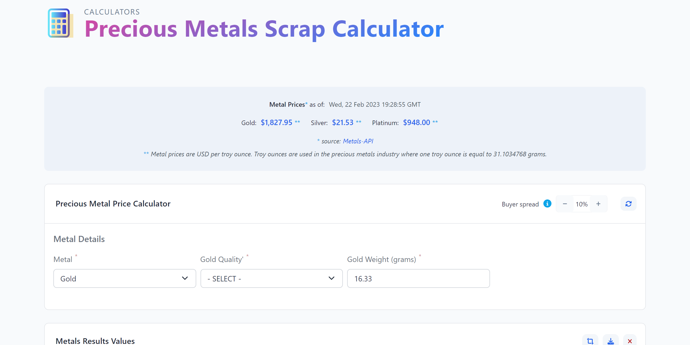

# EMD Precious Metals Calculator

This application is built using React, Redux, Typescript and Vite as the build tool.
The app fetches current spot metals prices for gold, platinum and silver in troy ounces and the visitor can calculate the market price of scrap jewelry metal by inputting the weight in grams, metal type and metal quality into a form.
The visitor can also upload, resize and crop an image for each item they are calculating the market value for. The data can be saved to the browser's local storage and the visitor can print a perfectly laid out pdf of their data.

The app was originally built with Express JS and Javascript for personal use, then later merged into a larger MERN stack application; again for personal use.
This represents the latest version as a publicly available stand-alone app powered by Vite with Typescript for type safety.

## How to use the App

Input the weight of the scrap metal in grams, select the metal type, and select the metal quality.

- [x] _Click_ on the `Update metal prices` button to fetch current prices from API, courtesy of [Metals-API.com](https://www.metals-api.com/). Once spot prices appear, you are ready to enter data.
- [x] The `dealer **concession**` plus/minus toggles are set to a default value of 10%. This represents the buyer's take as a percentage of net value.
- [x] _Select_ `Metal` type from the dropdown. Options include (Gold, Silver and Platinum)
- [x] Next Select metal `Quality` from the dropdown. Options that appear will be based on the metal you selected.
- [x] For example; gold options are in karat (i.e. 14k) while silver includes fine (99.9%) and sterling (92.5%)
- [x] Finally, enter the numerical value of your item's weight in grams in the provided text input element. 'Calculate' and 'Clear' buttons will display once you've entered your item's weight.
- [x] Once you've _clicked_ `Calculate`, a results section will appear along with a toolbar where you can save your data to local storage, print data to your printer or save it to pdf as well as a button to upload, size, crop and change image format.
- [x] Each result item will display an image upload element where you can upload an image for that item.

## Knowledge

### Example - Calculating the value of a gold ring

To calculate the scrap gold price of a ring that is `12.3 grams` of `14k gold`, we first need to convert the weight of the gold from grams to troy ounces (oz-t). One troy ounce is equal to `31.1034768 grams`.

To convert **`12.3 grams`** to troy ounces, we can use the following formula:

>_variables_:
>
>`ozt` = designator for troy ounces
>
>`Wsg` = scrap weight in grams (_i.e._ 12.3 grams)
>
>`Wst` = scrap weight in troy ounces
>
>_formula_: $\ Wst = { Wsg \over 31.1034768 } $
>
>$$\ Wst = { Wsg \over 31.1034768 } $$
>
>_example_: `Total Weight of scrap gold (ozt)`
>
>$$\ Wst = { 12.3grams \over 31.1034768 } $$
>
>$$\ Wst = 0.3955ozt$$

We now have the converted scrap weight in troy ounces.
However, we don't have the actual weight of pure gold since `14k` represents a percentage of gold alloyed with other metals, such as nickel or copper.
`14k` is a quality indicator often used in gold jewelry where `24k` represents pure gold at `~99.99%` gold.
Therefore, we can determine the percentage of pure gold in the ring with the following formula:

>_variables_:
>
>`k` = numerical _karat_ in gold quality (i.e. 14)
>
>`kr` = quality ratio
>
>_formula_:
>
>$$\ kr = { k \over 24 } $$
>
>_example_ : `ratio of gold in scrap`
>
>$$\ kr = { 14 \over 24 } $$
>
>$$\ kr = .58333$$

We can use the following formula to determine the weight of pure gold in the ring:

>_variables_:
>
>`Wp` = Weight in troy ounces of pure gold in scrap
>
>_formula_:
>
>$$\ Wp = kr \times Wst $$
>
>_example_: `Weight of pure gold in scrap`
>
>$$\ Wp = 0.58333 \times 0.3955$$
>
>$$\ Wp = 0.2307ozt$$

Finally, to calculate the scrap gold price of the ring, we multiply the weight of pure gold by the current market price of gold.
Using a fictional market price of `$1,923.34` per troy ounce for gold, we can use the following formula:

>_variables_:
>
>`Gs` = Gold spot price per troy ounce in USD (i.e. $1,923.34)
>
>`Vn` = Net scrap value in USD
>
>_formula_:
>
>$$\ Vn = Wp \times Gs $$
>
>_example_: `Net Value of Scrap Gold`
>
>$$\ Vn = 0.2307ozt \times \$1,923.34$$
>
>$$\ Vn = \$443.71$$

#### Final Step

Using the math above, we determined that the market value for the scrap gold is `$443.71`.
However, to convert your scrap piece into cash, you will need to sell it to a precious metals dealer or jeweler.
Keep in mind that a metals dealer's goal is to make a profit, so they will charge a fee or "concession" - often represented as a percentage of the metal's value.
To get the best deal, it's important to research and find a buyer who offers a reasonable spread and accurately assesses the quality and weight of your metal.
By entering your expected spread, you can estimate what you can expect to receive for your scrap gold before visiting a buyer.

## Screenshots



[sample price results in pdf](/frontend/src/globals/images/sample-metals-price-sheet.pdf)


## Requirements

- Node.js version 16 or higher
- npm version 6 or higher

## Getting started

### Clone the GitHub repository

```bash
$git clone git@github.com:stavaughan/emd-precious-metals-vite-ts.git
```

### CD to root directory

```bash
$cd emd-precious-metals-vite-ts
```

### Install dependencies backend

```bash
$npm install
```

### Install dependencies frontend

```bash
$cd frontend && npm install
```

### Start the development server

```bash
$cd.. && npm start
```

### Build the application

```bash
$cd frontend && npm run build:dev
```

Once the frontend static file has been compiled you can deploy your app on your favorite server. Follow their instructions as they may differ from the previous step:

## Contributing

We welcome contributions to the project. If you would like to contribute, please follow our [contribution guidelines](http://localhost:5173).

## License

The project is licensed under the [BSD 3-Clause License](LICENSE) License.

## Contact

LinkedIn: [www.linkedin.com/in/stephenavaughan](https://www.linkedin.com/in/stephenavaughan/)

twitter: [@Stephen26503352](https://twitter.com/Stephen26503352)
